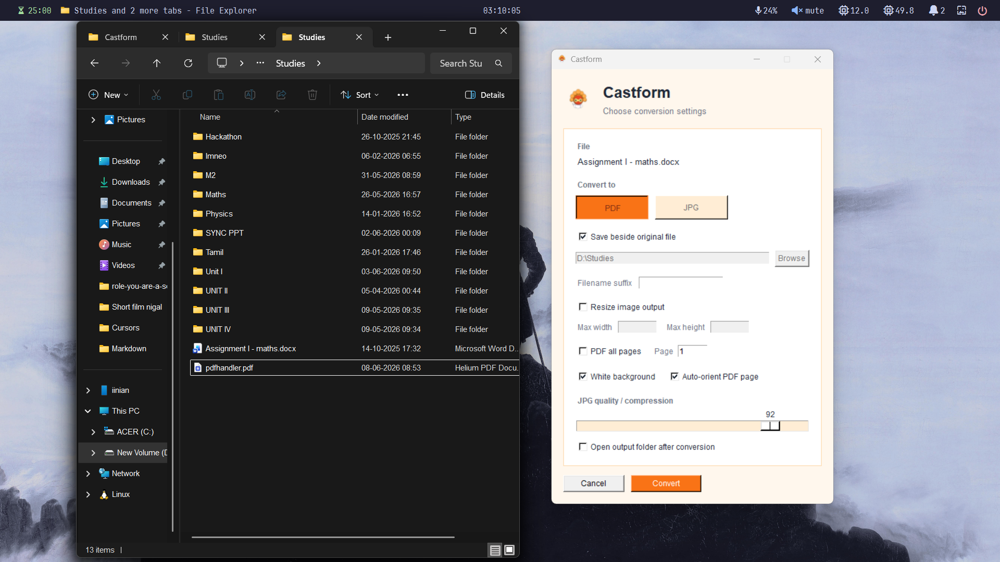

# Castform

Castform is a lightweight Windows file-conversion utility for File Explorer. Install it once, then right-click a supported file, choose **Castform**, select the output settings, and convert.



## What Castform Does

- Adds a **Castform** option to the Windows Explorer right-click menu.
- Opens a small conversion window when a file is selected.
- Converts files to **PDF** or **JPG** depending on what the source file supports.
- Runs as a portable single-file EXE with bundled dependencies.
- Can run from the system tray.
- Remembers your last conversion settings.
- Avoids overwriting existing files.

## Supported Conversions

| Source file | PDF output | JPG output |
| --- | --- | --- |
| `.docx` | Yes, through Microsoft Word | No |
| `.pptx` | Yes, through Microsoft PowerPoint | No |
| `.txt` | Yes | No |
| `.jpg`, `.jpeg` | Yes | Yes, for resize/compress |
| `.png` | Yes | Yes |
| `.bmp` | Yes | Yes |
| `.tif`, `.tiff` | Yes | Yes |
| `.webp` | Yes | Yes |
| `.pdf` | No | Yes |

Microsoft Office must be installed for `.docx` and `.pptx` conversion. PDF-to-JPG is bundled through PDFium via `pypdfium2`.

## Download Folder

Use the files in:

```text
github\release
```

For normal users, the important file is:

```text
Castform.exe
```

You can also share:

```text
Castform-release.zip
```

## Recommended Installation

1. Create a permanent folder for Castform, for example:

   ```text
   C:\Users\<you>\Apps\Castform
   ```

   or:

   ```text
   D:\Apps\Castform
   ```

2. Copy `Castform.exe` into that folder.

3. Double-click `Castform.exe` once.

4. Castform automatically:
   - installs the Explorer right-click menu;
   - starts the tray app;
   - registers tray startup through Windows.

5. Right-click a supported file in Explorer and choose **Castform**.

Do not keep the EXE only in `Downloads` if you plan to use it permanently. If you move `Castform.exe` later, double-click it again from the new location so the Explorer menu and startup path point to the correct file.

## Add Castform to `shell:startup`

Castform already registers tray startup automatically, but you can also add it to the Windows Startup folder manually.

1. Press `Win + R`.
2. Type:

   ```text
   shell:startup
   ```

3. Press Enter.
4. Create a shortcut to `Castform.exe` inside that folder.
5. Edit the shortcut target and add `--tray` after the EXE path:

   ```text
   "D:\Apps\Castform\Castform.exe" --tray
   ```

Use a shortcut instead of moving the EXE into Startup. Keep the real EXE in your permanent Castform folder.

## Using the Explorer Menu

1. Open File Explorer.
2. Right-click a supported file.
3. Select **Castform**.
4. Choose **PDF** or **JPG** in the Castform window.
5. Adjust folder, suffix, resize, PDF, or compression settings.
6. Click **Convert**.

Unsupported output choices are disabled automatically. For example, `.docx` can convert to PDF, so JPG is disabled.

## UI Rules

### Convert To

- **PDF** creates a `.pdf` output.
- **JPG** creates a `.jpg` output.
- Buttons are enabled only when that conversion is supported.

### Save Beside Original File

When checked, Castform writes the output into the same folder as the source file.

Example:

```text
D:\Studies\Assignment.docx
D:\Studies\Assignment.pdf
```

When this is checked, the folder text box and **Browse** button are disabled because Castform is using the original file location.

### Custom Output Folder

To choose another folder:

1. Uncheck **Save beside original file**.
2. Click **Browse**.
3. Select an existing folder or create a new folder in the Windows folder picker.
4. Click **Convert**.

The custom path must be a folder, not a file path. If the folder does not exist, create it first from the folder picker or in File Explorer.

### Filename Suffix

The suffix is added before the extension.

Example:

```text
photo.png
photo-compressed.jpg
```

If you type:

```text
web
```

the output becomes:

```text
photo-web.jpg
```

Castform removes unsafe filename characters such as:

```text
< > : " / \ | ? *
```

### Existing File Rule

Castform never overwrites an existing output file.

If this already exists:

```text
sample.pdf
```

Castform creates:

```text
sample (1).pdf
```

then:

```text
sample (2).pdf
```

This also protects same-extension conversions such as JPG-to-JPG compression.

### Resize Image Output

Enable **Resize image output** to limit output dimensions.

- **Max width** limits width in pixels.
- **Max height** limits height in pixels.
- You can fill one field or both.
- Aspect ratio is preserved.
- Images are not stretched.

Resize applies to image outputs and image-based PDF rendering.

### PDF All Pages

For PDF-to-JPG:

- unchecked: Castform exports one page;
- checked: Castform exports every page.

When **PDF all pages** is enabled, the **Page** field is ignored.

All-pages output is named like:

```text
document-page-001.jpg
document-page-002.jpg
document-page-003.jpg
```

### Page

For PDF-to-JPG single-page export, enter a 1-based page number.

Example:

```text
1
```

means the first page.

```text
3
```

means the third page.

If the PDF has fewer pages than the number you enter, Castform shows an error.

### White Background

This affects transparent images such as PNG files.

- checked: transparent areas become white;
- unchecked: transparent areas become black.

Use white background for documents, screenshots, diagrams, and most normal sharing.

### Auto-Orient PDF Page

This affects image-to-PDF conversion.

- checked: landscape images are placed on landscape PDF pages;
- unchecked: Castform uses the default page orientation.

This helps wide screenshots and landscape photos fit better.

### JPG Quality / Compression

The slider controls JPG quality.

- Higher value: better quality, larger file.
- Lower value: more compression, smaller file.

Recommended values:

```text
90-95  high quality
75-85  balanced
40-70  smaller files
```

### Open Output Folder After Conversion

When checked, Castform opens File Explorer and selects the output file after conversion.

For all-pages PDF export, it opens the folder containing the generated files.

## Tray Menu

The tray icon gives quick access to:

- install Explorer menu;
- remove Explorer menu;
- start tray with Windows;
- do not start with Windows;
- open Castform folder;
- quit.

If the tray icon is hidden, check the Windows notification overflow area.

## Command-Line Usage

Command-line usage is mainly for development and testing.

Convert with popup:

```powershell
.\Castform.exe "D:\Studies\Assignment.docx"
```

Convert directly to PDF:

```powershell
.\Castform.exe "D:\Studies\Assignment.docx" --target pdf
```

Convert directly to JPG:

```powershell
.\Castform.exe "D:\Studies\image.webp" --target jpg
```

Compress and resize:

```powershell
.\Castform.exe "D:\Studies\photo.jpg" --target jpg --quality 80 --max-width 1600
```

Export every PDF page:

```powershell
.\Castform.exe "D:\Studies\notes.pdf" --target jpg --pdf-all-pages
```

Export one PDF page:

```powershell
.\Castform.exe "D:\Studies\notes.pdf" --target jpg --pdf-page 3
```

Write to a custom folder:

```powershell
.\Castform.exe "D:\Studies\photo.png" --target jpg --output-dir "D:\Converted"
```

Add a suffix:

```powershell
.\Castform.exe "D:\Studies\photo.png" --target jpg --suffix compressed
```

## Build From Source

Clone or copy the repo folder:

```text
github\repo
```

Create and activate a virtual environment:

```powershell
py -m venv .venv
.\.venv\Scripts\Activate.ps1
```

Install dependencies:

```powershell
python -m pip install --upgrade pip
python -m pip install -r requirements.txt
python -m pip install -r requirements-optional.txt
python -m pip install pyinstaller
```

Build the EXE:

```powershell
powershell -ExecutionPolicy Bypass -File .\packaging\build-exe.ps1
```

Test the EXE:

```powershell
powershell -ExecutionPolicy Bypass -File .\packaging\test-exe.ps1
```

## Troubleshooting

### Castform is not in the right-click menu

Double-click `Castform.exe` again from its permanent folder.

If you moved the EXE, the old right-click entry may still point to the old path. Double-clicking from the new location refreshes the path.

### The tray icon does not appear after reboot

Add a shortcut manually:

1. Press `Win + R`.
2. Type `shell:startup`.
3. Create a shortcut to `Castform.exe`.
4. Add `--tray` to the shortcut target.

### Word or PowerPoint conversion fails

Install and activate Microsoft Office. Castform uses Word and PowerPoint automation for high-fidelity Office-to-PDF export.

### Output went to the wrong folder

Check whether **Save beside original file** is enabled.

- enabled: output goes beside the source file;
- disabled: output goes to the folder selected with **Browse**.

### I cannot select a custom folder

Uncheck **Save beside original file** first.

### My PDF created many JPG files

You enabled **PDF all pages**. Disable it to export only the page shown in the **Page** field.

## Repository Layout

```text
castform.py                  CLI entry point
castform/                    app modules
packaging/                   EXE/MSI build scripts
tests/                       smoke tests
docs/castform-ui.png         UI screenshot
requirements.txt             core dependencies
requirements-optional.txt    PDF-to-JPG dependency
pngwing.com (2).ico          app icon
```

## License

MIT
